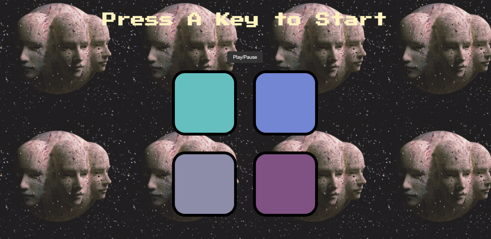

# Simon - Juego de Memoria "Oscura"

## Descripción

Simon es un juego de memoria con temática "oscura". El objetivo del juego es recordar y repetir la secuencia de colores generada por la computadora. Cada nivel aumenta en complejidad, desafiando tu capacidad de memoria. ¡Demuestra tus habilidades para llegar a niveles más altos!

## Tecnologías utilizadas

El juego Simon ha sido desarrollado utilizando las siguientes tecnologías:

- HTML
- CSS
- JavaScript (con jQuery)

## Instrucciones

1. Abre el archivo `index.html` en tu navegador web.
2. Verás cuatro botones de colores: rojo, azul, verde y amarillo.
3. El juego comenzará con un mensaje "Press A Key to Start". Presiona cualquier tecla para empezar.
4. El juego reproducirá una secuencia de colores aleatorios. Presta atención a la secuencia mostrada.
5. Luego, tendrás que repetir la secuencia haciendo clic en los botones en el mismo orden en que aparecieron.
6. Si aciertas, el juego mostrará el siguiente nivel y aumentará la longitud de la secuencia.
7. Si te equivocas, el juego se detendrá, y verás un mensaje "Game Over, Press Any Key to Restart".
8. Puedes reiniciar el juego presionando cualquier tecla para volver a empezar desde el nivel 1.

## Controles

- Presiona cualquier tecla para iniciar el juego.
- Haz clic en los botones de colores para repetir la secuencia generada por el juego.

## Créditos

El juego Simon fue desarrollado por [Jamiro Manriquez](https://github.com/jamirou/).

## Licencia

Este proyecto está bajo la Licencia MIT - ver el archivo [LICENSE.md](LICENSE.md) para más detalles.

## Notas adicionales

- El botón "Play/Pause" permite controlar la música de fondo del juego.
- El juego ha sido ambientado con una temática "oscura" para añadir un toque especial al clásico Simon.

¡Diviértete jugando Simon! Si tienes alguna pregunta o sugerencia, no dudes en abrir un issue en este repositorio. ¡Gracias por jugar!
